# 🚀 Bikin Aplikasi Pakai GitHub Copilot: From Zero to Hero!

> **"Pernah nggak sih pengen bikin aplikasi tapi bingung mulainya dari mana? Atau udah coba ngoding tapi hasilnya kayak puzzle yang nggak kelar-kelar?"**

Tenang! Dengan GitHub Copilot, bikin aplikasi itu kayak punya asisten coding yang jago banget. Cuma masalahnya, banyak yang nggak tahu cara "ngomong" yang bener sama Copilot. 

Mari kita belajar cara ngobrol sama AI biar dapet hasil yang mantul! 🎯

---

## 🤗 Hey, Sebelum Mulai... Jangan Pusing Dulu!

> **"Kalau kamu baca ini dan udah mulai pusing atau takut, STOP! Tarik napas dulu..."**

### 😌 Mulai Se-Simpel Itu Aja

**Kamu nggak perlu:**
- ❌ Langsung jadi expert
- ❌ Hafalin semua konsep programming
- ❌ Baca panduan ini sampai habis dulu
- ❌ Takut sama teknologi

**Yang kamu butuh cuma:**
- ✅ **Buka browser** dan ketik "cara membuat aplikasi"
- ✅ **Ketik "cara menggunakan AI"** di Google
- ✅ **Coba satu hal kecil** dulu
- ✅ **Eksplorasi pelan-pelan**

### 🎯 Start dari Yang Super Gampang

**Hari ini cukup:**
1. **Buka VS Code** (atau download kalau belum punya)
2. **Install extension GitHub Copilot** (ikutin tutorial di Google)
3. **Bikin file baru** dan coba ketik komentar: `// bikin fungsi hello world`
4. **Lihat magic-nya** Copilot kasih saran!

**Besok baru:**
- Baca bagian "Konsep Dasar" di bawah
- Coba template sederhana
- Mulai project kecil

### 💪 Ingat: Setiap Expert Pernah Jadi Pemula

- **Mark Zuckerberg** mulai dari bikin website profil sederhana
- **Bill Gates** mulai dari program calculator
- **Kamu** mulai dari membaca artikel ini

**Yang penting:** **MULAI!** Nggak usah sempurna, nggak usah takut salah. Coding itu skill yang bisa dipelajari siapa aja!

> **🌟 "Perjalanan seribu mil dimulai dari satu langkah. Perjalanan jadi programmer dimulai dari satu baris kode."**

---

## 📖 Daftar Isi

1. [Konsep Dasar: AI itu Kayak Apa Sih?](#-konsep-dasar-ai-itu-kayak-apa-sih)
2. [Strategi 3 Langkah: Dari Ide Jadi Kode](#-strategi-3-langkah-dari-ide-jadi-kode)
3. [Tips Komunikasi dengan AI](#-tips-komunikasi-dengan-ai)
4. [Template Siap Pakai](#-template-siap-pakai)
5. [Mengatasi Error dengan Mudah](#-mengatasi-error-dengan-mudah)
6. [Strategi Multi-AI](#-strategi-multi-ai)
7. [Best Practices & Tips Pro](#-best-practices--tips-pro)

---

## 🤔 Konsep Dasar: AI itu Kayak Apa Sih?

### Analogi Tukang Bangunan

Bayangin GitHub Copilot itu kayak **tukang bangunan yang super jago**. Dia bisa bikin apa aja—rumah, gedung, jembatan. Tapi masalahnya, dia nggak bisa baca pikiran kamu.

| ❌ **Instruksi Tidak Jelas** | ✅ **Instruksi yang Spesifik** |
|---|---|
| *"Bikinin rumah dong!"* | *"Bikinin rumah 2 lantai, 3 kamar tidur, ada garasi, budget 500 juta, di lahan 10x15 meter, gaya minimalis modern."* |
| **Hasil:** Random, mungkin gubuk, mungkin istana | **Hasil:** Sesuai keinginan dan kebutuhan |

### Prinsip Emas Komunikasi AI

> **"Makin detail dan jelas instruksi kamu, makin oke hasilnya!"**

**Kenapa begitu?**
- AI nggak punya konteks seperti manusia
- AI butuh informasi lengkap untuk memahami tujuan kamu
- Detail membantu AI memberikan solusi yang tepat sasaran

---

## 🎯 Strategi 3 Langkah: Dari Ide Jadi Kode

### Langkah 1️⃣: Mulai dari Ide Kasar

Kayak lagi mikirin mau masak apa buat makan malam. Awalnya kan cuma "pengen makan enak". Itu udah cukup buat mulai!

**Contoh ide kasar yang bagus:**
```
✅ "Pengen bikin aplikasi buat catat pengeluaran"
✅ "Mau bikin website toko online sederhana"  
✅ "Pengen belajar bikin game puzzle"
✅ "Butuh aplikasi untuk manage to-do list"
```

### Langkah 2️⃣: Eksplorasi Fitur dengan AI

Ini kayak nanya ke teman yang udah berpengalaman: *"Eh, kalau mau bikin toko online tuh biasanya ada fitur apa aja?"*

**Template Eksplorasi:**
```
Kalau mau bikin [ide aplikasi kamu], fitur apa aja yang biasanya ada dan berguna? 

Tolong kelompokkan berdasarkan:
- Fitur wajib (must-have)
- Fitur bagus ada (nice-to-have)  
- Fitur advanced (optional)
```

**Keuntungan:**
- Kamu jadi tahu standar industri
- Bisa pilih fitur sesuai kemampuan
- Nggak ketinggalan fitur penting

### Langkah 3️⃣: Validasi Teknis

Setelah tahu fiturnya, sekarang waktunya nanya soal teknis. Kayak nanya ke tukang: *"Bisa gak bikin rumah kayak gini? Pakai bahan apa? Berapa lama?"*

**Template Validasi:**
```
Aplikasi [nama aplikasi] dengan fitur:
- [fitur 1]
- [fitur 2] 
- [fitur 3]

Pertanyaan:
1. Bisa dibuat pakai teknologi apa yang gampang dipelajari?
2. Estimasi waktu pengerjaan berapa lama?
3. Ada kendala teknis yang perlu dipertimbangkan?
4. Tools/library apa yang direkomendasikan?
```

---

## 💬 Tips Komunikasi dengan AI

### ❌ Hindari Kesalahan Umum

| **Jangan** | **Alasannya** | **Sebaiknya** |
|---|---|---|
| Terlalu formal<br>*"Mohon dengan hormat, bisakah Anda..."* | Membuang waktu, AI nggak butuh basa-basi | Langsung to the point<br>*"Tolong bikinin aplikasi yang..."* |
| Terlalu sopan<br>*"Maaf kalau merepotkan..."* | AI jadi "sungkan" kasih kritik | Tegas dan jelas<br>*"Tunjukkan kalau ada yang salah"* |
| Setengah-setengah<br>*"Kayaknya mau bikin app..."* | AI bingung dengan keraguan | Yakin dan spesifik<br>*"Saya mau bikin aplikasi..."* |

### ✅ Cara Komunikasi yang Efektif

#### 1. **Gunakan Bahasa Sehari-hari**
```
❌ "Implementasikan functional requirements dengan optimal performance"
✅ "Bikin fitur yang jalan cepat dan user-friendly"
```

#### 2. **Berikan Konteks yang Cukup**
```
❌ "Bikin login"
✅ "Bikin sistem login dengan email/password, ada remember me, dan forgot password"
```

#### 3. **Minta Penjelasan Balik**
```
✅ "Jelasin balik permintaan saya biar kita sepemahaman dulu sebelum mulai coding"
```

### 🎛️ Manfaatkan Configure Instructions

Di VS Code, ada fitur **Configure Instructions** yang kayak ngasih "brief" ke asisten pribadi.

**Analogi:** Kayak ngasih tahu ART baru tentang kebiasaan keluarga. "Kalau masak jangan terlalu asin ya. Kalau bersihin kamar, tolong lipatkan baju yang di kursi."

**Contoh Configure Instructions yang Bagus:**
```
- Selalu kasih komentar di setiap fungsi
- Kalau ada error, langsung kasih solusinya  
- Pakai bahasa santai, jangan terlalu formal
- Prioritaskan code yang mudah dibaca dan dipelihara
- Selalu tanyakan jika ada yang kurang jelas
```

---

## 📋 Template Siap Pakai

### 🎯 Template untuk Brainstorming dengan ChatGPT/Gemini

```markdown
## Ide Aplikasi Saya
[Ceritain ide kamu bebas, meskipun masih acak-acakan]

Contoh: "Gue pengen bikin aplikasi buat nyimpen resep masakan. Tapi bingung mau ada fitur apa aja, terus make teknologi apa. Pokoknya yang gampang dipelajari lah, soalnya gue masih newbie."

## Yang Gue Butuh dari Lo
1. Tolong sarankan fitur yang cocok dan berguna
2. Rekomendasikan teknologi yang mudah dipelajari
3. Kasih tau hal-hal penting yang mungkin gue belum kepikiran
4. Buatkan prompt lengkap yang bisa gue kasih ke Copilot

## Ekspektasi
- Jangan bikinin kodenya dulu, cukup promptnya aja
- Jelasin balik permintaan gue biar kita sepemahaman
- Kalau ada yang kurang jelas, tanya dulu
```

### 🛠️ Template untuk Copilot (Hasil dari ChatGPT)

```markdown
## Project Brief
**Aplikasi:** [Nama dan tujuan aplikasi]
**Target User:** [Siapa yang bakal pakai]
**Platform:** [Web/Desktop/Mobile]

## Fitur Requirements
### Core Features (Wajib)
- [ ] [Fitur 1 dengan detail]
- [ ] [Fitur 2 dengan detail]
- [ ] [Fitur 3 dengan detail]

### Nice-to-Have Features
- [ ] [Fitur tambahan 1]
- [ ] [Fitur tambahan 2]

## Technical Specifications
**Frontend:** [Teknologi yang dipilih]
**Backend:** [Jika perlu]
**Database:** [Jika perlu]
**Additional Libraries:** [Library yang dibutuhkan]

## Struktur Project
Tolong buatkan struktur folder dan file yang rapi, dengan:
- Separasi concerns yang jelas
- Nama file dan folder yang descriptive
- Dokumentasi di setiap file penting

## Development Approach
1. Mulai dengan wireframe/mockup sederhana
2. Implement core features dulu
3. Testing di setiap tahap
4. Dokumentasi yang jelas

## Deliverables
- [ ] Complete source code
- [ ] README dengan instruksi setup
- [ ] Basic documentation
- [ ] Testing instructions
```

### 🔧 Template Universal (Isi Titik-titik)

```markdown
Halo! Gue mau bikin [isi: ide aplikasi kamu]

## Details
**Yang gue pengen:**
- [isi fitur yang kamu mau, atau tulis "belum tahu, tolong sarankan"]
- [tambah lagi atau hapus kalau cuma satu]

**Teknologi pilihan:** [isi teknologi pilihan, atau tulis "yang gampang dipelajari"]
**Level gue:** [isi: "pemula banget" atau "udah pernah coding dikit"]

## Yang Gue Bingung
- Fitur apa lagi yang biasanya ada?
- Teknologi apa yang paling cocok?
- Ada yang perlu gue tahu sebelum mulai?

## Request
Tolong bikinin prompt lengkap yang bisa gue kasih ke Copilot buat bikin aplikasi ini. 

**Penting:** Jangan bikinin kodenya dulu, cukup promptnya aja. Dan tolong jelasin balik permintaan gue dengan bahasa lo sendiri, biar gue yakin kita udah sepemahaman.
```

---

## 🚨 Mengatasi Error dengan Mudah

> **"Jangan panik kalau ada error! Error itu teman, bukan musuh."**

### 📊 Jenis-jenis Error dan Solusinya

#### 1. 🖥️ Error di Terminal/Console (Paling Mudah)

**Langkah Super Simpel:**
1. **Copy pesan error lengkap** dari terminal VS Code
2. **Paste langsung ke Copilot** (tanpa embel-embel)
3. **Copilot otomatis kasih solusi**

**Contoh:**
```bash
ModuleNotFoundError: No module named 'requests'
```
*Paste aja error ini ke Copilot → Dia langsung tahu kamu perlu install requests!*

#### 2. 🖼️ Error di GUI/Pop-up (Agak Tricky)

**Strategi A: Minta Print ke Console**
```
Aplikasi saya error tapi pesannya muncul di GUI. Tolong ubah semua error message supaya muncul di terminal/console juga, jangan cuma di GUI.
```

**Strategi B: Screenshot + AI Helper**
1. **Screenshot pesan error** (jangan foto pakai HP!)
2. **Upload ke ChatGPT/Gemini:** *"Tolong OCR/bacakan teks di screenshot ini"*
3. **Copy hasil OCR → Paste ke Copilot**

#### 3. 😶 Silent Error (Aplikasi Nggak Jalan)

**Debugging Steps:**
1. **Jalankan dari terminal** (bukan double-click)
   ```bash
   python nama_aplikasi.py
   ```
2. **Tambah debug prints:**
   ```
   Tolong tambahkan print() di setiap fungsi penting supaya saya tahu aplikasi jalan sampai mana.
   ```

#### 4. 🤯 Error Kompleks/Panjang

**Strategi Bertahap:**
1. **Copy error lengkap**
2. **Tanya ChatGPT:** *"Error ini artinya apa? Jelaskan dengan bahasa sederhana"*
3. **Setelah paham → Tanya Copilot dengan konteks yang lebih jelas**

### 🛡️ Template Error Handling

```markdown
Tolong tambahkan error handling yang comprehensive:

## Requirements
- [ ] Semua error di-print ke terminal/console
- [ ] Try-catch di bagian rawan (file ops, network, dll)
- [ ] Error messages yang user-friendly
- [ ] Aplikasi nggak crash tiba-tiba
- [ ] Log error untuk debugging

## Error Categories
- [ ] Input validation errors
- [ ] File/Database errors  
- [ ] Network/API errors
- [ ] Unexpected errors

Pastikan setiap error kasih informasi yang berguna untuk debugging.
```

---

## 🤝 Strategi Multi-AI

> **"Jangan terpaku sama satu AI! Kombinasikan kekuatan beberapa AI untuk hasil optimal."**

### 🎯 Mengapa Perlu Multi-AI?

| **Alasan** | **Benefit** |
|---|---|
| **Specialized Strengths** | Setiap AI punya keunggulan masing-masing |
| **Backup Plan** | Kalau satu AI down/limit, ada alternatif |
| **Cross-Validation** | Hasil lebih akurat karena ter-validasi |
| **Cost Efficiency** | Gunakan yang gratis dulu, berbayar untuk critical |

### 🔄 Workflow Multi-AI yang Efektif

```mermaid
graph TD
    A[Ide Mentah] --> B[Gemini: OCR & Brainstorming]
    B --> C[ChatGPT: Problem Solving & Prompt Creation]
    C --> D[Claude: Review & Refinement] 
    D --> E[Copilot: Code Implementation]
    E --> F[Error?]
    F -->|Yes| G[Back to ChatGPT/Claude]
    F -->|No| H[Success! 🎉]
```



### 🎨 Pembagian Tugas AI

#### 🟢 **Gemini (Google) - Si Jagoan Gratis**
**Kelebihan:**
- ✅ OCR dan analisis gambar (gratis & akurat)
- ✅ Riset cepat dan fact-checking
- ✅ Brainstorming ide kreatif
- ✅ Nggak ada batasan ketat

**Cocok Untuk:**
- Analisis screenshot error
- Eksplorasi ide awal
- Pertanyaan cepat & klarifikasi

#### 🔵 **ChatGPT (OpenAI) - Si Pemecah Masalah**
**Kelebihan:**
- ✅ Kemampuan problem-solving yang excellent
- ✅ Analisis error yang kompleks
- ✅ Pembuatan prompt yang terstruktur
- ✅ Penjelasan yang komprehensif

**Cocok Untuk:**
- Mengubah ide berantakan jadi prompt terstruktur
- Debugging masalah rumit
- Penjelasan teknis yang detail

#### 🟣 **Claude (Anthropic) - Si Reviewer**
**Kelebihan:**
- ✅ Excellent untuk review kode
- ✅ Optimisasi technical writing
- ✅ Analisis yang detail
- ✅ Free tier yang lumayan

**Cocok Untuk:**
- Review dan perbaikan prompt
- Assessment kualitas kode
- Perbaikan dokumentasi

#### ⚫ **Copilot (GitHub) - Si Eksekutor**
**Kelebihan:**
- ✅ Integrasi langsung dengan VS Code
- ✅ Generate kode real-time
- ✅ Saran yang context-aware
- ✅ Perbaikan error instant

**Cocok Untuk:**
- Implementasi kode final
- Bantuan coding real-time
- Resolusi error

### 📋 Contoh Workflow Lengkap

**Skenario:** Bikin aplikasi to-do list dengan error handling

#### **Fase 1: Ideation & Planning**
```
1. Gemini → "Brainstorm fitur-fitur to-do app yang modern dan berguna"
2. ChatGPT → "Ubah ide ini jadi prompt terstruktur untuk Copilot"
3. Claude → "Review prompt ini, ada yang kurang atau bisa diperbaiki?"
```

#### **Fase 2: Implementation**
```
4. Copilot → Eksekusi prompt yang sudah di-refine
5. Test aplikasinya
```

#### **Fase 3: Error Resolution** (kalau perlu)
```
6. Screenshot error → Gemini → "OCR pesan error ini"
7. Teks error → ChatGPT → "Jelasin error ini dan kasih pendekatan solusinya"
8. Solusi → Claude → "Review solusi ini untuk best practices"
9. Fix final → Copilot → "Implementasikan solusi yang sudah di-review"
```

### 💰 Tips Hemat Multi-AI

#### **Strategi Free Tier**
1. **Mulai dengan Gemini** (unlimited free usage)
2. **Pakai Claude free tier** untuk review
3. **Simpan ChatGPT** untuk masalah kompleks
4. **Copilot** untuk implementasi final

#### **Teknik Optimisasi**
- **Simpan prompt yang bagus** untuk reuse
- **Dokumentasikan workflow yang sukses**
- **Pakai template** untuk minimize interaksi AI
- **Gabungkan pertanyaan serupa** dalam satu sesi

---

## ⭐ Best Practices & Tips Pro

### 🎯 Tips Komunikasi yang Efektif

#### **Metode CLEAR**
- **C**ontext: Berikan latar belakang yang cukup
- **L**evel: Sebutkan level skill kamu
- **E**xpectation: Jelaskan hasil yang diharapkan
- **A**ssumption: Sebutkan asumsi-asumsi penting
- **R**eview: Minta AI jelasin balik untuk konfirmasi

#### **Contoh Implementasi CLEAR:**
```markdown
## Context
Saya mau bikin aplikasi inventory untuk toko kecil. Saat ini mereka catat manual di buku.

## Level  
Saya pemula di programming, tapi udah familiar dengan HTML/CSS dasar.

## Expectation
Aplikasi web sederhana yang bisa:
- Input/edit/hapus barang
- Track stok
- Laporan sederhana

## Assumptions
- Pakai komputer biasa (Windows)
- Internet tersedia
- Database lokal (nggak perlu cloud)

## Review Request
Tolong jelasin balik pemahaman Anda tentang project ini sebelum mulai coding.
```

### 🔧 Tips Development yang Efektif

#### **Mulai Kecil, Berkembang Cerdas**
```
Fase 1: Fitur inti saja
Fase 2: Tambah fitur nice-to-have  
Fase 3: Polish & optimisasi
```

#### **Mental Model Version Control**
```
1. Bikin versi dasar yang jalan
2. Test dengan teliti
3. Tambah satu fitur sekali
4. Test lagi setelah setiap penambahan
```

#### **Strategi Pencegahan Error**
```markdown
## Selalu Minta
- [ ] Validasi input
- [ ] Error handling
- [ ] Pesan error yang jelas
- [ ] Graceful fallbacks
- [ ] Logging untuk debugging
```

### 📚 Learning & Improvement

#### **Dokumentasikan Kemenangan Kamu**
```markdown
## Library Prompt yang Sukses
### [Tanggal] - [Jenis Project]
**Prompt:** [Yang berhasil]
**Hasil:** [Yang kamu dapat]
**Pelajaran:** [Yang kamu pelajari]
```

#### **Bangun Koleksi Template Kamu**
- Simpan prompt yang berhasil dengan baik
- Adaptasi pola-pola yang sukses
- Share dengan komunitas
- Terus perbaiki dan refine

#### **Tetap Update**
- Ikuti update tools AI
- Gabung komunitas developer
- Eksperimen dengan fitur baru
- Belajar dari pengalaman orang lain

---

## 🎉 Kesimpulan & Action Plan

### ✅ Yang Udah Kamu Pelajari

**Skill Fundamental:**
- [x] Cara komunikasi efektif dengan AI
- [x] Strategi 3 langkah dari ide ke implementasi
- [x] Template-template siap pakai
- [x] Error handling yang proper

**Teknik Advanced:**
- [x] Optimisasi workflow multi-AI
- [x] Best practices development
- [x] Strategi troubleshooting
- [x] Mindset continuous improvement

### 🌟 Moment Check: Kamu Udah Sejauh Ini!

> **"Coba lihat deh, kamu udah sampai sini! Dari yang mungkin awalnya cuma bingung atau takut, sekarang udah punya roadmap lengkap."**

#### 🎉 **Celebrate Small Wins**
- ✅ **Kamu udah berani baca sampai sini** - Itu progress!
- ✅ **Kamu mulai paham AI bukan monster** - Itu insight besar!
- ✅ **Kamu punya template dan strategi** - Itu modal utama!
- ✅ **Kamu tahu cara handle error** - Itu skill valuable!

#### 💪 **Reality Check yang Positive**
**Sekarang kamu tahu:**
- Cara ngomong sama AI yang efektif
- Strategi step-by-step yang jelas
- Tools dan resource yang dibutuhkan
- Mindset yang tepat untuk sukses

**Yang belum kamu tahu:** Detail implementasi - **DAN ITU NORMAL!**

> **🔥 "Pengetahuan tanpa action itu cuma teori. Action tanpa pengetahuan itu chaos. Tapi kamu sekarang punya keduanya!"**

#### 🚀 **Ready to Launch?**
**Kalau masih ragu:**
- Mulai dari project super kecil (hello world aja)
- Pakai template yang udah ada
- Ingat: error itu normal, bukan kegagalan

**Kalau udah siap:**
- Let's build something awesome!
- Start small, dream big
- AI is your co-pilot, not your replacement

### 🚀 Langkah Selanjutnya

#### **Aksi Langsung (Hari Ini)**
1. **Pilih ide project sederhana**
2. **Pakai Template Universal** untuk brainstorming
3. **Ikuti strategi 3 langkah** 
4. **Mulai coding dengan Copilot**

#### **Minggu Ini**
1. **Selesaikan project pertama kamu**
2. **Dokumentasikan apa yang berhasil**
3. **Coba workflow multi-AI** 
4. **Bangun skill error handling**

#### **Bulan Ini**
1. **Bikin 2-3 aplikasi berbeda**
2. **Buat library prompt kamu**
3. **Bantu orang lain di komunitas**
4. **Eksplorasi fitur AI advanced**

### 💡 Tips Final

> **"Ingat: AI adalah tools yang powerful, tapi kamu tetap yang mengendalikan!"**

**Mindset yang Benar:**
- ✅ AI sebagai **kolaborator**, bukan pengganti
- ✅ **Belajar** lebih penting daripada kesempurnaan
- ✅ **Iterasi** lebih baik daripada prokrastinasi
- ✅ **Komunitas** mempercepat pertumbuhan

**🧠 Percaya Diri dengan Kemampuan Kamu:**
- ✅ **Jangan terlalu kagum pada AI** - Kamu punya otak sungguhan, bukan mesin!
- ✅ **AI itu cuma tools** - Kayak kalkulator yang canggih, tapi yang mikir tetap kamu
- ✅ **Kreativitas kamu unik** - AI bisa kasih saran, tapi ide brilliant datang dari kamu
- ✅ **Problem-solving adalah skill manusia** - AI bantu eksekusi, tapi analisis masalah itu expertise kamu
- ✅ **Pengalaman nggak bisa di-replace** - Setiap error yang kamu solve, itu knowledge yang beneran

**🚫 Jangan Takut atau Nyerah:**
- ❌ **"AI lebih pintar dari saya"** → AI cuma punya data, kamu punya intuisi dan common sense
- ❌ **"Nanti AI gantiin programmer"** → AI butuh manusia yang paham konteks dan tujuan
- ❌ **"Saya gak akan bisa"** → Setiap programmer expert pernah jadi pemula, kamu bisa!
- ❌ **"Mending pake AI aja"** → AI tanpa pemahaman manusia = recipe for disaster

> **💪 "Kamu itu partner AI, bukan korbannya! Pakailah AI untuk amplify kemampuan kamu, bukan untuk menggantikan kamu."**

**Red Flag yang Harus Dihindari:**
- ❌ Terlalu dependent pada AI
- ❌ Nggak belajar konsep fundamentalnya
- ❌ Copy-paste tanpa memahami
- ❌ Belajar sendirian (nggak share/tanya)

---

## 🔗 Resource & Komunitas

### **Link Berguna**
- [GitHub Copilot Documentation](https://docs.github.com/copilot)
- [VS Code AI Tools](https://code.visualstudio.com/docs/editor/artificial-intelligence)
- [Developer Communities](https://stackoverflow.com/) 

### **Terus Belajar**
- Praktik rutin dengan project kecil
- Gabung komunitas coding
- Share progress kamu
- Bantu orang lain belajar

---

**Selamat coding! Semoga aplikasi impian kamu jadi kenyataan! 🚀✨**

*"The best time to plant a tree was 20 years ago. The second best time is now."*
